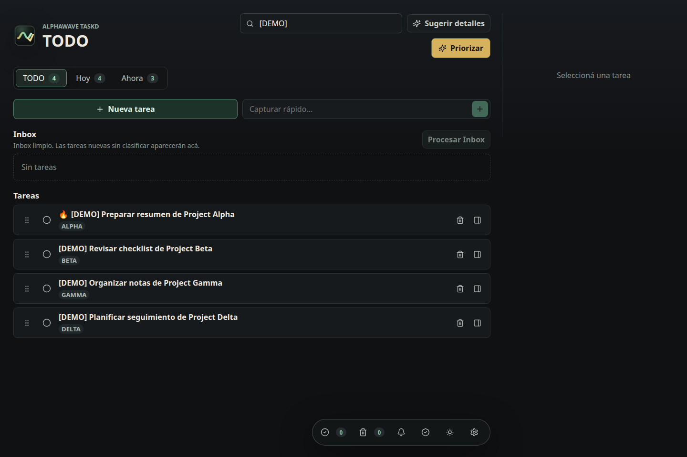
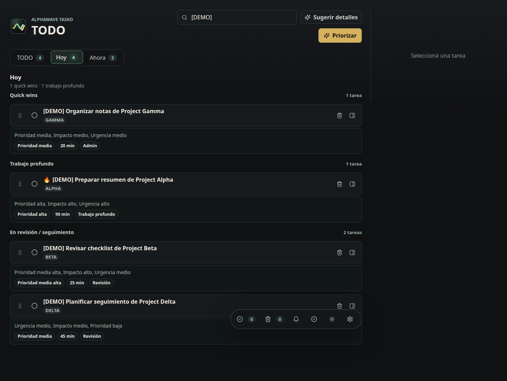
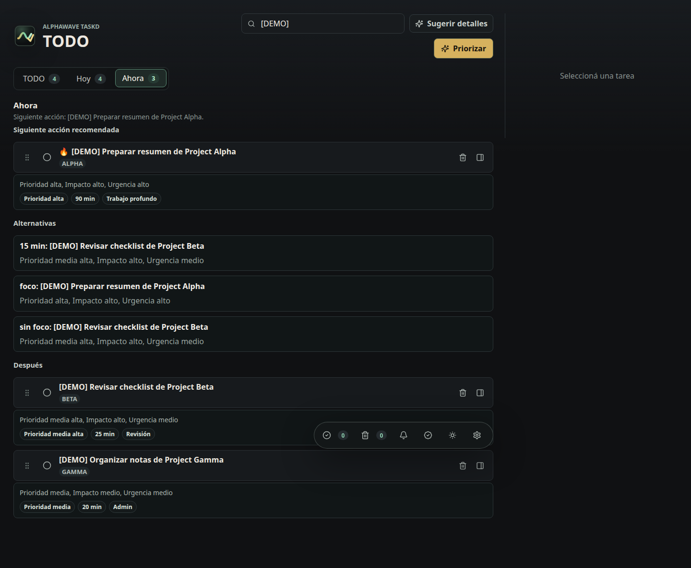
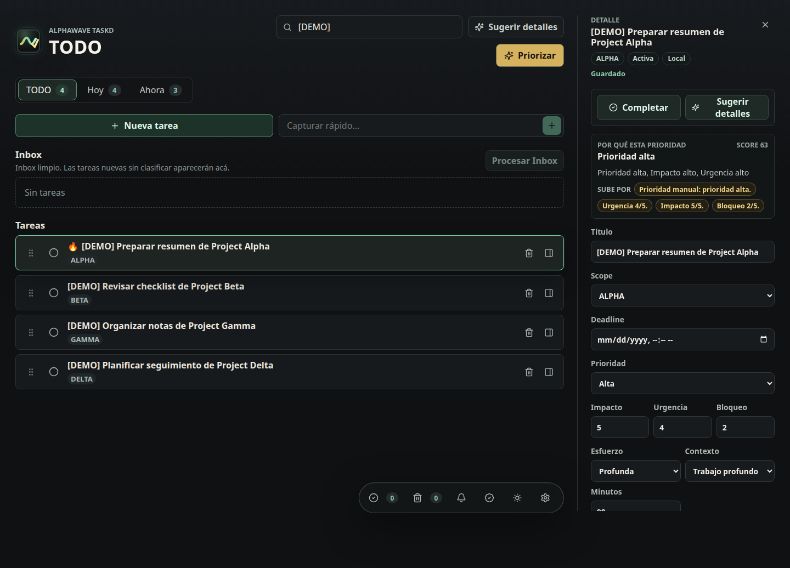

# AlphaWave TaskD

AlphaWave TaskD is a local-first task command center with a FastAPI backend, a React/Vite interface, SQLite persistence, optional Telegram commands, optional Trello sync, and explicit confirmation queues for operations that can affect external systems.

The project is open source and experimental. It is designed for local use and carefully configured private deployments, not as a hosted multi-tenant SaaS.

License: Apache-2.0. Status: initial open-source release candidate; not a hosted multi-tenant service.

## What It Does

- Local task capture, completion, soft delete, restore, permanent delete, search, and detail editing.
- Planning views for `TODO`, `Hoy`, `Ahora`, Inbox processing, reminders, completed tasks, trash, confirmations, briefing, settings, and system status.
- Priority planning with explainable scoring, local proposals, and confirmation before applying order changes.
- AI-assisted task detail suggestions through the OpenAI Responses API, with deterministic heuristic fallback.
- Bulk suggestion queues and bulk confirmation workflows.
- Trello read-only sync plus guarded write actions for card creation, moves, renames, and deadlines.
- Telegram command handling, reminders, daily briefing, and safety smokes that avoid sending messages by default.
- Weekend mode, backup controls, diagnostics export, release-candidate checks, and browser smoke tests.
- Auth shell and per-user ownership groundwork for private beta readiness.

## Stack

- Backend: Python 3.12, FastAPI, SQLAlchemy, SQLite, pytest.
- Frontend: React, TypeScript, Vite.
- Integrations: Telegram Bot API, Trello API, and optional OpenAI Responses API.
- Operations: Docker Compose, nginx, systemd templates, diagnostic bundles, and smoke scripts.

## Quick Start

```bash
git clone https://github.com/agustinpic72/alphawave-taskd.git
cd alphawave-taskd
docker compose up --build
```

Open <http://localhost:8711>. Docker Engine with the Compose plugin is supported on Linux; Docker Desktop is supported on macOS and Windows, with the WSL2 backend recommended on Windows.

CI truth: Linux is build- and runtime-tested, including named-volume persistence. macOS Docker Desktop and Windows Docker Desktop/WSL2 are supported manual paths, not hosted-CI claims. Windows containers are not supported.

The default stack is local-only and starts without external credentials. It publishes only the nginx gateway; FastAPI remains on the internal Docker network. SQLite data and backups persist in named volumes across restarts and ordinary `docker compose down` operations.

```bash
docker compose up -d --build
docker compose ps
docker compose logs -f
```

Do not run `docker compose down -v` unless you intend to permanently delete the stack database and backups. See the [Docker guide](docs/docker.md) for port and environment overrides, authentication setup, backups, upgrades, and troubleshooting.

### Native Development

For backend and frontend development without containers:

```bash
cp .env.example .env
python3 -m venv backend/.venv
backend/.venv/bin/pip install -e "backend[dev]"
cd frontend && npm ci && npm run build
```

Keep `.env` local. Do not add real Telegram or Trello credentials unless you are intentionally testing those integrations. OpenAI API keys are entered in Settings and stored encrypted per user.

The default backend binds to `127.0.0.1:8711`. Runtime behavior such as briefing, reminders, priority scoring, weekend mode, backups, and Trello mappings is managed from the app Settings UI. `.env` is reserved for infrastructure and sensitive values such as host/port, database URL, auth secrets, API tokens, and encryption keys.

Deployment mode is explicit. `ALPHAWAVE_DEPLOYMENT_MODE=local` permits an unauthenticated loopback-only workflow and exposes local API docs. `private` and `public` fail startup unless app authentication is enabled, disable development endpoints and `/docs`, `/redoc`, and `/openapi.json`; `public` also requires secure cookies.

## Development

```bash
backend/.venv/bin/pytest -q
cd frontend && npm run build
```

Useful local checks:

```bash
./scripts/dev/browser-smoke.sh
./scripts/dev/rc-check.sh
./scripts/dev/export-diagnostics.sh
./scripts/dev/publication-audit.sh
./scripts/dev/docker-smoke.sh
```

GitHub Actions runs publication audit, backend pytest, frontend build, Docker Compose configuration/build, and an isolated loopback runtime/persistence smoke with unique images and volumes. It does not publish images or use integration secrets. Browser smoke, RC checks, diagnostics export, Trello live smoke, and Telegram live smoke stay manual/local.

The live Telegram and Trello smoke scripts are designed with opt-in write gates. Do not enable live sends or Trello writes unless you are intentionally testing those integrations.

## Configuration

Start with `.env.example` and copy it to `.env`. Development works without external credentials because integrations are disabled by default.

Important defaults:

- `ALPHAWAVE_AUTH_ENABLED=false` for local dogfooding.
- `ALPHAWAVE_DEPLOYMENT_MODE=local`; use `private` or `public` only with the required auth settings.
- `TELEGRAM_ENABLED=false`.
- `TRELLO_ENABLED=false`.
- `TRELLO_WRITE_ENABLED=false`.
- SQLite data lives under `data/`, which is ignored by git.

Set a stable Fernet `ALPHAWAVE_SECRET_ENCRYPTION_KEY` before storing per-user integration secrets. Configure OpenAI from `Settings > OpenAI`: save an API key, validate the connection, choose a model, then enable it. The API key is never returned after saving. Selected task data is sent to OpenAI with `store=false`; failed or disabled calls use the deterministic heuristic fallback.

## Safety Model

This repository must not include local runtime data or secrets:

- No `.env` files.
- No SQLite databases.
- No backups.
- No diagnostic bundles or reports.
- No Telegram tokens, Trello tokens, OpenAI keys, chat IDs, or private support artifacts.

Every Trello write is first stored as a user-owned pending confirmation and is revalidated when that confirmation is executed. Telegram send smokes are disabled by default. SQLite backups use a consistent snapshot plus checksums; restore is admin-only, validates integrity/schema/metadata, creates a safety backup, and can roll back a failed replacement. Diagnostics are sanitized before export, but generated bundles remain local artifacts and are ignored by git.

## Documentation

- [Architecture](docs/architecture.md)
- [Security policy](SECURITY.md)
- [Support policy](SUPPORT.md)
- [Contributing](CONTRIBUTING.md)
- [Asset provenance](docs/asset-provenance.md)
- [Docker](docs/docker.md)
- [Docker soak checklist](docs/docker-soak-checklist.md)
- [First run](docs/first-run.md)
- [Settings runtime contract](docs/settings-runtime-contract.md)
- [Dogfooding checklist](docs/dogfooding-checklist.md)
- [Private beta deployment](docs/vps-private-beta-runbook.md)
- [Open-source license decision](docs/open-source-license-decision.md)
- [GitHub publication checklist](docs/github-publication-checklist.md)
- [Release process](docs/release-process.md)
- [Changelog](CHANGELOG.md)
- [Roadmap](ROADMAP.md)

## Open-Source Status

AlphaWave TaskD is an open-source local-first task manager licensed under Apache-2.0. It is an experimental project with no hosted service or uptime commitment. See the [release checklist](docs/github-publication-checklist.md) and [roadmap](ROADMAP.md) for the current public scope.

## Screenshots

These screenshots are generated from a temporary demo database with `[DEMO]` tasks only. Public examples use `Project Alpha` through `Project Delta` and aliases `ALPHA` through `DELTA`. Regenerate them with `scripts/dev/generate-demo-screenshots.sh`; do not publish screenshots from a real local database.








