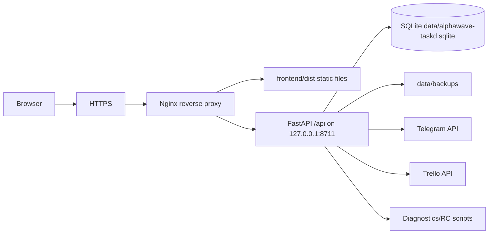

# Web/VPS Deployment Architecture

M19A documents the path from the current local single-user app to a hosted web app. It does not implement hosting, auth, multi-user, Android, payments or ads.

## Current Local Architecture

AlphaWave TaskD currently runs as a local-first service:

- FastAPI listens on `127.0.0.1:8711`.
- React/Vite builds into `frontend/dist`.
- FastAPI mounts `frontend/dist` at `/` when the build exists.
- `/api/*` routes are served by the same FastAPI process.
- SQLite lives under `data/` through `DATABASE_URL=sqlite:///data/alphawave-taskd.sqlite`.
- Backups live under `data/backups/` as `.sqlite.gz` files with metadata sidecars.
- `systemd --user` runs `python -m app.main` with `.env` loaded from the repo.
- Telegram, Trello and LLM secrets stay in `.env`.
- `app_settings` stores non-secret runtime behavior in SQLite and is global.
- Background workers run in-process: Telegram polling, reminders, briefing and Trello sync.
- Diagnostics and RC scripts are local-safe and redact secrets.

Important current constraints:

- There is no authentication boundary.
- CORS is local/dev oriented.
- All data tables are effectively single-user/global.
- SQLite migrations are `create_all` plus targeted SQLite `ALTER TABLE` compatibility code, not a hosted migration system.
- Trello/Telegram credentials are instance-level, not user-level.

## Target Phase 1 VPS Architecture

Phase 1 should be a private web beta that behaves like the current local app, but reachable from a browser through HTTPS.

Recommended topology:



Recommended internal port:

- Keep `APP_HOST=127.0.0.1`.
- Keep `APP_PORT=8711`.
- Expose only nginx on `80/443`.

## Serving Options

### Option A - One FastAPI Process Serves Frontend and API

FastAPI serves `/api/*` and mounts `frontend/dist` at `/`.

Pros:

- Already works in the current code path.
- Smallest deployment change.
- Good for a quick private VPS smoke.
- One service to restart.

Cons:

- Public static serving, cache headers and TLS are better handled by nginx.
- Harder to split web cache behavior from API behavior.
- FastAPI becomes responsible for all web traffic.

Risks:

- Accidentally binding FastAPI to `0.0.0.0` without auth would expose the app.
- Static routing mistakes could mask API errors.

Minimum changes:

- Build frontend before deploy.
- Configure systemd service on the VPS.
- Put nginx or an SSH tunnel in front for TLS/access control.

### Option B - Nginx Static Frontend + FastAPI API

Nginx serves `frontend/dist` and proxies `/api/*` to FastAPI on `127.0.0.1:8711`.

Pros:

- Best Phase 1 recommendation.
- HTTPS, gzip/static cache headers and request limits live at nginx.
- FastAPI remains private to localhost.
- Easy to add basic auth/IP allowlist before real app auth.
- Easy to later split frontend/API domains if needed.

Cons:

- Requires nginx config and cert management.
- Requires deploy checklist to keep `frontend/dist` in sync with backend.

Risks:

- Misconfigured fallback could proxy all paths to API or expose files.
- Browser smoke must validate the public URL, not only localhost.

Minimum changes:

- Add a future nginx site template.
- Add deployment docs for build, restart and health checks.
- Add a public-base-url RC mode using `ALPHAWAVE_BASE_URL=https://...`.

### Option C - Hosted Multi-User Foundation

FastAPI becomes an authenticated multi-user API with Postgres, per-user integrations and a worker model.

Pros:

- Required for real hosted product and mobile clients.
- Enables per-user Telegram/Trello credentials, quotas and billing.
- Better concurrent write behavior than SQLite.

Cons:

- Larger product and data migration.
- Requires auth, authorization, migrations, encryption and user lifecycle work.
- Background workers must become user-aware.

Risks:

- A partial multi-user migration can leak data across users.
- Moving integrations before ownership boundaries are explicit is dangerous.

Minimum changes:

- Introduce users/accounts and auth.
- Add `user_id` ownership to data models.
- Move secrets into encrypted per-user storage.
- Adopt real migrations before schema expansion.

### Option D - Mobile-First Backend Future

Versioned API, mobile auth tokens, Android client, push notifications and subscription/ads support.

Pros:

- Aligns with Android and Play Store goals.
- Forces cleaner API contracts and server-authoritative writes.

Cons:

- Premature without hosted auth and user-owned data.
- Push, offline cache and payments add operational surface.

Risks:

- Building Android against single-user/global backend creates rework.
- Monetization before account model creates awkward migrations.

Minimum changes:

- Stable `/api/v1` contracts.
- Token/session strategy for mobile.
- User-scoped sync and notification preferences.

## Recommended Deployment Topology

Use Option B for Phase 1:

- nginx terminates HTTPS and serves `frontend/dist`.
- nginx proxies `/api/` to `http://127.0.0.1:8711`.
- FastAPI stays bound to localhost.
- SQLite remains in `data/` for private beta.
- systemd runs the backend as a dedicated service.
- RC checks run against the public HTTPS URL before a release is considered good.

FastAPI should keep its static mount because it is useful for local/dev and as a fallback. It should not be the primary public static server once nginx is configured.

M19B adds non-destructive scaffolding for this topology:

- nginx template: `deploy/nginx/alphawave-taskd.nginx.example`;
- systemd template: `deploy/systemd/alphawave-taskd.service.example`;
- server env template: `deploy/env/alphawave-taskd.env.example`;
- VPS runbook: [VPS private beta runbook](vps-private-beta-runbook.md);
- release gate: [Release process](release-process.md);
- readiness matrix: [Production readiness](production-readiness.md).

M19C expands the hosted/multi-user part of this plan:

- [Multi-user readiness audit](multi-user-readiness-audit.md);
- [Multi-user data ownership matrix](multi-user-data-ownership-matrix.md);
- [Multi-user migration plan](multi-user-migration-plan.md).

## SQLite vs Postgres

Phase 1 decision: keep SQLite.

Why:

- Current code, backups and restore UX are SQLite-oriented.
- Private single-instance beta has one owner and low concurrency.
- It minimizes deployment work and preserves dogfooding speed.

Conditions:

- Do not offer public multi-user signups on SQLite.
- Keep one backend process writing to the DB.
- Put the DB and backups on persistent disk.
- Run backup validation and restore-plan checks.
- Treat SQLite as a temporary Phase 1 decision, not product architecture.

Postgres becomes required for:

- multiple users;
- multiple app workers;
- paid/free account quotas;
- per-user integrations;
- reliable migrations;
- mobile sync at product scale.

## systemd, nginx and HTTPS Plan

Phase 1 systemd:

- Use a system service or a hardened user service depending on VPS style.
- `WorkingDirectory` should point to the repo or release directory.
- `EnvironmentFile` should point to a server-side `.env`.
- `ExecStart` remains `backend/.venv/bin/python -m app.main`.
- `Restart=on-failure` remains appropriate.
- The service should run as a non-root user.

Phase 1 nginx:

- Serve `frontend/dist` with `try_files $uri /index.html`.
- Proxy `/api/` to `http://127.0.0.1:8711`.
- Set `client_max_body_size` conservatively.
- Add request timeout limits.
- Add basic auth or IP allowlist until app auth exists.

HTTPS:

- Mandatory for any public hostname.
- Use Let's Encrypt/certbot or provider-managed TLS.
- Redirect HTTP to HTTPS.
- Do not send Telegram/Trello/OpenAI secrets through browser or diagnostics.

## Env and Secrets Plan

Phase 1:

- Keep `.env` server-side only.
- Never expose `.env` through nginx.
- Keep instance Telegram/Trello secrets and the Fernet master key in `.env`; OpenAI keys are encrypted per user.
- Keep `APP_HOST=127.0.0.1`.
- Set `APP_PORT=8711`.
- Set `DATABASE_URL` to an absolute or release-stable SQLite path.
- Configure CORS explicitly for the public origin if frontend/API are split by origin.

Hosted future:

- Move per-user Trello/Telegram/OpenAI credentials out of `.env`.
- Store user integration secrets encrypted at rest.
- Keep instance-level secrets in environment/secret manager.
- Add secret rotation docs and audit trail.

## Backups Plan

Phase 1:

- Keep existing SQLite `.sqlite.gz` backups under `data/backups/`.
- Store `data/` on persistent VPS disk.
- Add off-server backup copy before relying on VPS as source of truth.
- Keep manual backup and restore-plan as release gates.
- Do not expose backup files directly through nginx.
- Diagnostics bundles remain support artifacts, not backups.

Future:

- For Postgres, replace file-copy backup with database-native backups.
- Keep per-user export/delete flows for privacy and account deletion.
- Decide retention policy per plan tier only after user model exists.

## Diagnostics and Support Bundle Plan

Existing diagnostics are a good Phase 1 base:

- `/api/system/status` provides redacted runtime status.
- `/api/system/diagnostics` provides sanitized support payload.
- `scripts/dev/export-diagnostics.sh` creates local support bundles.

Hosted constraints:

- Diagnostics endpoints must require auth before public access.
- Support bundles must not include `.env`, SQLite, backup files, tokens, chat IDs or full remote URLs with secrets.
- Public UI should not expose repo path or host filesystem paths beyond redacted labels.

## RC Check as Release Gate

Phase 1 gate:

```bash
time backend/.venv/bin/pytest -q --durations=50
backend/.venv/bin/pytest -q
cd frontend && npm run build
ALPHAWAVE_BASE_URL=https://your-domain.example ./scripts/dev/browser-smoke.sh
ALPHAWAVE_BASE_URL=https://your-domain.example ./scripts/dev/rc-check.sh
git diff --check
```

Required pass conditions:

- backend tests pass;
- frontend build passes;
- browser smoke passes on the public HTTPS URL;
- rc-check passes;
- diagnostics export passes;
- manual backup + validate + restore-plan pass;
- Trello read-only smoke passes or is explicitly skipped;
- Telegram live smoke passes or is explicitly skipped;
- system status has no P0/P1 warnings.

No Phase 1 gate should send Telegram or write Trello by default.

## Multi-User Readiness Inventory

The table below is the short M19A inventory. The detailed M19C version is in [Multi-user data ownership matrix](multi-user-data-ownership-matrix.md).

| Component | Current State | Future User Scope | Migration Risk | Suggested Approach |
| --- | --- | --- | --- | --- |
| `app_settings` | Global key/value JSON in SQLite. | Per user or per workspace, plus instance defaults. | High: settings influence integrations and workers. | Add `users`, then `user_id`/`workspace_id`; migrate current settings to owner user. |
| tasks | Global table with local and Trello mirrors. | Per user/workspace; external source uniqueness per user. | High: all primary UI data. | Add ownership columns before auth rollout; enforce every query by owner. |
| reminders | Global reminders; Telegram channel per reminder. | Per user; delivery channel belongs to user. | High: notifications can leak. | Add owner and notification target mapping. |
| confirmations | Global pending actions. | Per user; action execution requires owner. | High: dangerous writes. | Scope confirmation creation/list/execute by owner and integration. |
| Trello boards/settings | Global board mappings in `app_settings`. | Per user integration or workspace integration. | High: tokens and board IDs are private. | Store encrypted Trello account credentials and board mappings by user. |
| Telegram config/chat mapping | `.env` token and allowlist; updates store chat/from IDs. | Per user chat binding, likely one bot or per-tenant strategy. | High: chat IDs and commands must never cross accounts. | Add verified Telegram account link table and owner-bound snapshots. |
| backups | Global DB file backups. | Instance-level for single tenant; per-user export for hosted. | Medium/High after Postgres. | Keep instance backups; add per-user export/delete later. |
| runtime status/events | Global service status and events. | Admin-visible plus user-visible subset. | Medium: can reveal other users/integrations. | Split admin diagnostics from user account status. |
| diagnostics | Global support bundle. | Admin-only; user-safe diagnostic subset. | High if public. | Require auth/admin, redact identifiers, avoid raw paths. |
| browser smoke data | Shared prefixes in global DB. | Test tenant or local-only. | Medium: smoke data in prod can pollute users. | Use dedicated test instance or test user with cleanup gates. |

## API Boundary Inventory

| Area | Current Endpoints | Classification | Notes |
| --- | --- | --- | --- |
| health/status | `/api/health`, `/api/system/health`, `/api/system/status`, `/api/system/diagnostics` | Auth required before public; diagnostics admin-only. | Health can stay public only if coarse and non-sensitive. |
| tasks | `/api/tasks`, task CRUD, complete/restore/delete/reorder, suggestions | Suitable for mobile with auth; some writes need confirmation/undo. | Needs versioning and ownership filters. |
| planning | `/api/planning/today`, `/api/planning/now` | Suitable for mobile with auth. | Read-only and good candidate for Android. |
| settings | `/api/settings`, schema, reset, Trello board config | Web/admin-heavy; auth required. | Mobile may need user preferences subset, not full Settings UI contract. |
| Trello sync/status | `/api/trello/sync`, `/api/trello/status` | Auth required; sync is user/admin action. | Public multi-user needs per-user queues/rate limits. |
| Trello writes | `/api/trello/cards/*`, confirmation execution | Dangerous/write requires confirmation. | Must enforce ownership, idempotency and audit. |
| confirmations/jobs | `/api/confirmations`, `/api/jobs` | Suitable with auth; dangerous for bulk confirm. | Must scope and rate-limit. |
| reminders | `/api/reminders` | Suitable for mobile with auth. | Server-authoritative notifications. |
| briefing | `/api/briefing/*` | Auth required; send endpoints are side-effecting. | Mobile can read status/runs; manual send should be guarded. |
| backups | `/api/backups/*`, `/api/system/backup*` | Admin-only. | Never expose downloadable backup files without auth. |
| LLM | `/api/llm/status`, `/api/llm/validate` | Status user-safe subset; validate admin/user action. | Quotas matter in monetized future. |
| dev simulator | `/api/dev/simulate-message` | Dev-only; disable on public. | Should not exist in hosted public runtime unless guarded by test mode. |
| Telegram processing | `/api/telegram/process-pending` | Admin/internal. | Hosted future should move processing to worker/webhook with auth. |

## Security Considerations

Required before any public hostname:

- HTTPS mandatory.
- Auth mandatory before public access.
- Keep FastAPI bound to localhost behind nginx.
- Secrets stay server-side.
- Backups and diagnostics require auth and redaction.
- CORS should allow only configured public origins.
- If cookie auth is chosen, add CSRF protection.
- If token auth is chosen, use short-lived access tokens plus refresh/session rotation.
- Add rate limits for login, suggestions, Telegram/Trello actions and backup endpoints.
- Trello/Telegram user tokens must be encrypted or stored in a real secret store before multi-user.
- Disable or strongly guard `/api/dev/*` in hosted public mode.

## Risks and Mitigations

| Risk | Impact | Mitigation |
| --- | --- | --- |
| Public app without auth | Full data/control exposure. | Phase 1 must be private: basic auth/IP allowlist until app auth exists. |
| SQLite corruption or disk loss | Data loss. | Persistent disk, backups, off-server copy, restore-plan gate. |
| Secret leakage through diagnostics/logs | Account compromise. | Keep redaction tests and support bundle exclusions. |
| Trello write mistake | Remote card mutation. | Keep confirmation gates; no automated write smokes by default. |
| Telegram bot exposed to multiple users | Cross-user commands/leaks. | Keep allowlist for Phase 1; design per-user linking for hosted. |
| No migration system | Hosted schema changes become risky. | Adopt migrations before multi-user/Postgres. |
| Background workers global | Multi-user fairness and leakage. | Move to per-user scheduled jobs/queues in Phase 3. |

## Recommended Path

1. Phase 1: VPS web private beta with nginx, HTTPS, localhost FastAPI, SQLite and existing RC gates.
2. Phase 2: public web hardening with real auth for one admin/user, stricter CORS, dev endpoint guard and deployment templates.
3. Phase 3: multi-user backend with Postgres, migrations, user-owned data and encrypted integrations.
4. Phase 4: Android API client on versioned authenticated APIs.
5. Phase 5: premium/free monetization after user/account/billing boundaries exist.
